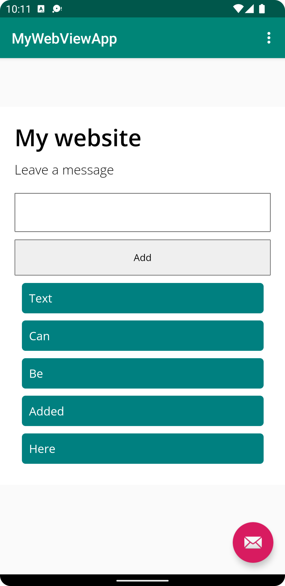

# Report

This assignment implements a WebView component in _content_main.xml_, which can then be accessed through its identifier in _MainActivity.java_. From there, additional attributes are programmatically applied to render a website onto the screen.

## content_main.xml

```xml
<WebView
    android:id="@+id/my_webview"
    android:layout_width="wrap_content"
    android:layout_height="wrap_content"
    android:text="Hello World!"
    app:layout_constraintBottom_toBottomOf="parent"
    app:layout_constraintLeft_toLeftOf="parent"
    app:layout_constraintRight_toRightOf="parent"
    app:layout_constraintTop_toTopOf="parent" />
```

## MainActivity.java

Note how the identifier is used to retrieve the component:

```java
myWebView = findViewById(R.id.my_webview);
myWebView.getSettings().setJavaScriptEnabled(true);

WebViewClient webViewClient = new WebViewClient();
myWebView.setWebViewClient(webViewClient);
```

There are two distinct methods for loading a website; one for loading a website from a public URL, and another to load a website from the local context.

```java
public void showExternalWebPage(){
    myWebView.loadUrl("https://www.jetbrains.com");
}

public void showInternalWebPage(){
    myWebView.loadUrl("file:///android_asset/index.html");
}
```

## Internal web page

<p align="center">
  
</p>

## External web page

<p align="center">
  
</p>
